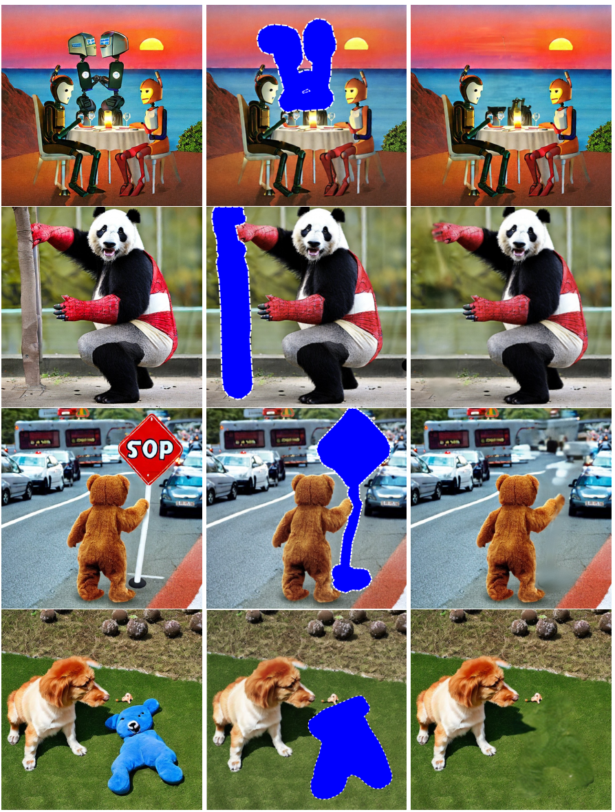
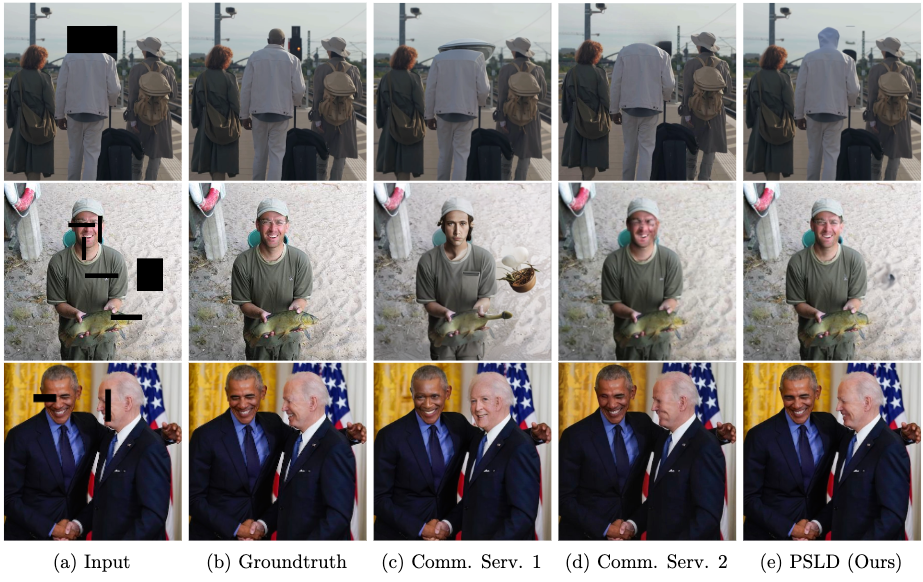
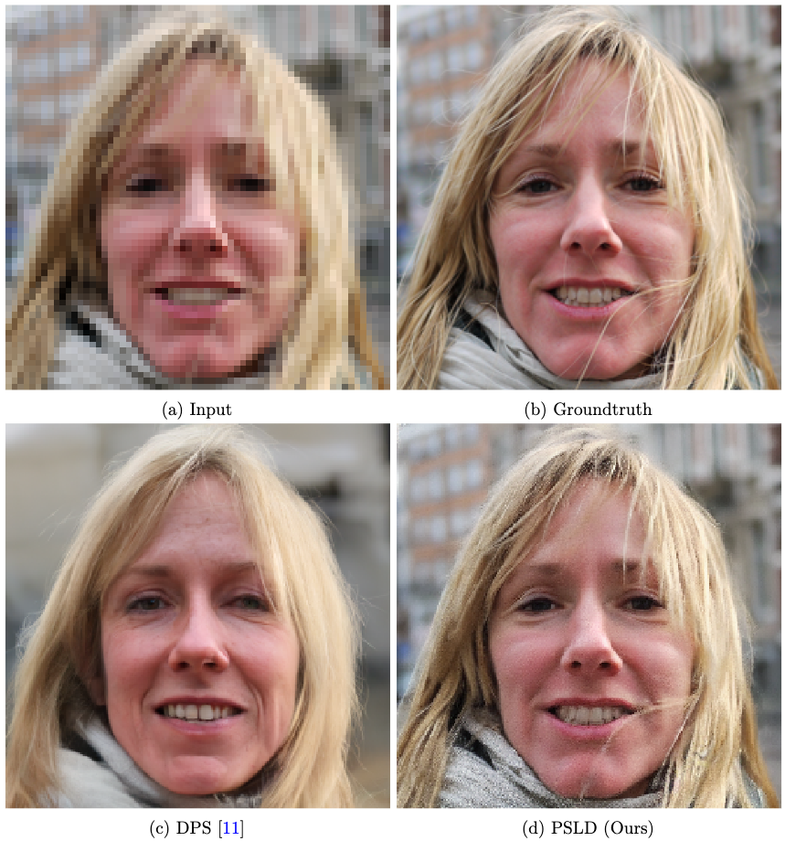
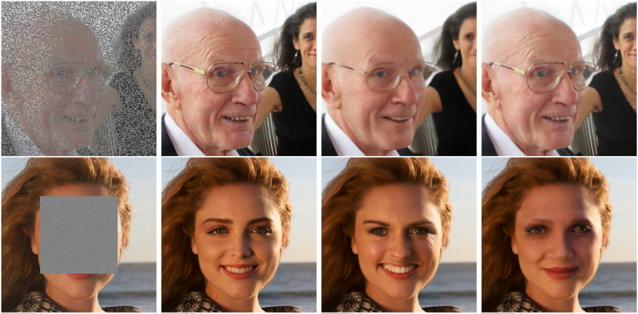
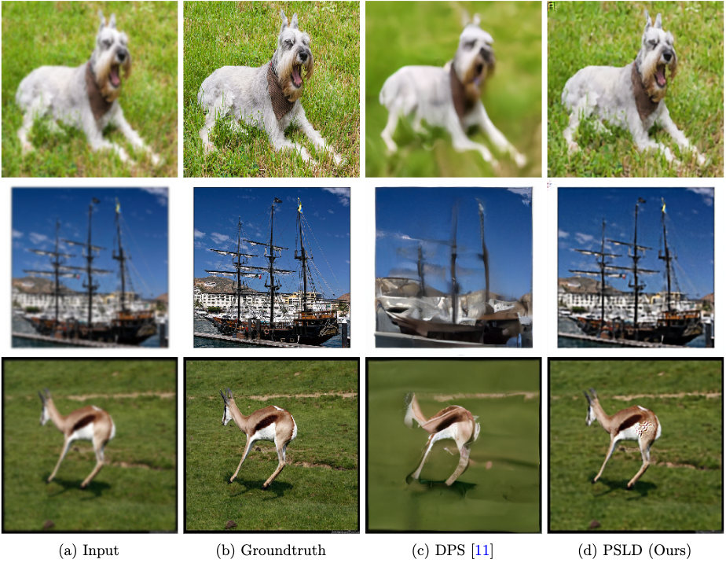
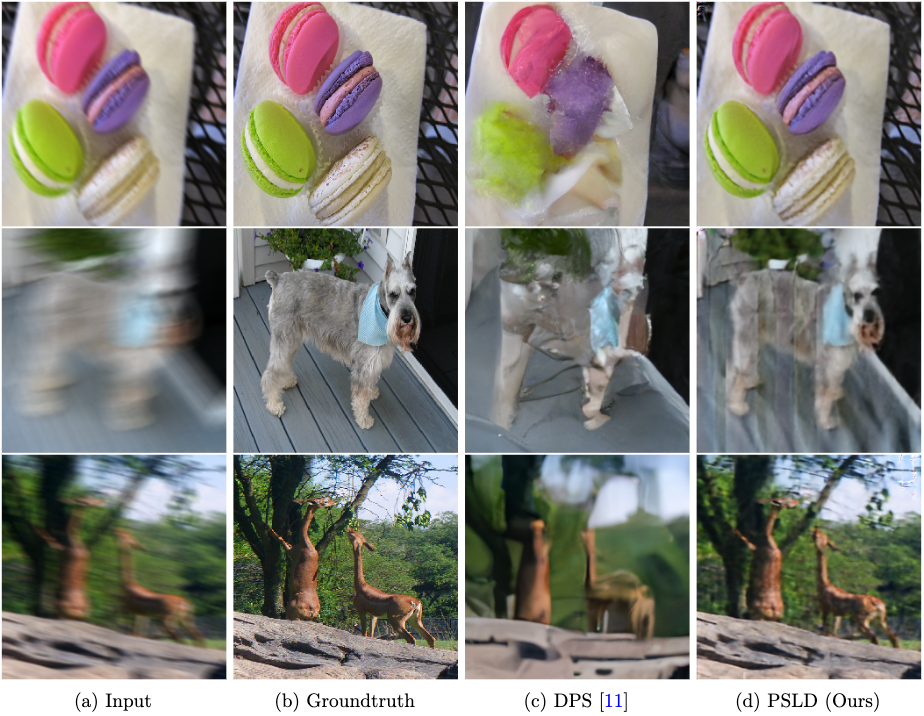

# Solving Linear Inverse Problems Provably via Posterior Sampling with Latent Diffusion Models

The repository contains reproducible `PyTorch` source code of our paper [Solving Linear Inverse Problems Provably via Posterior Sampling with Latent Diffusion Models](https://arxiv.org/pdf/2307.00619.pdf). We present the first framework to solve general inverse problems leveraging pre-trained *latent* diffusion models.  Previously proposed algorithms (such as DPS and DDRM) only apply to *pixel-space* diffusion models.  We theoretically analyze our algorithm showing provable sample recovery in a linear model setting. The algorithmic insight obtained from our analysis extends to more general settings often considered in practice. Experimentally, we outperform previously proposed posterior sampling algorithms in a wide variety of problems including random inpainting, block inpainting, denoising, deblurring, destriping, and super-resolution.


## Overall pipeline of our proposed framework from left to right. A web application is hosted at [gradio space](https://huggingface.co/spaces/PSLD/PSLD).

<p align="center"></p>


## Comparison with state-of-the-art commercial services leveraging Stable Diffusion
This experiment was performed on commercial platforms that use (to the best of our knowledge) Stable diffusion and additional proprietary models. This evaluation was performed on models deployed in May 2023 and may change as  commercial providers improve their platforms.

<p align="center"></p>


## Prerequisites
The implementation is GPU-based. A single GPU (A100) is sufficient to run all experiments. Tested with 
`torch==1.12.0 torchvision==0.13.1a0`. To reproduce the reported results, consider using the exact version of `PyTorch` and its required dependencies as other versions might be incompatible. Make sure to install all the required packages for [`/diffusion-posterior-sampling/`](https://github.com/LituRout/PSLD/tree/main/diffusion-posterior-sampling) and [`/stable-diffusion/`](https://github.com/LituRout/PSLD/tree/main/stable-diffusion). Check if the DPS sampler and Stable Diffusion sampler are working before proceeding to the next steps. Use the latest version of generative foundation model ([Stable Diffusion v1-5 Model Card is used in this repo](https://huggingface.co/runwayml/stable-diffusion-v1-5/resolve/main/v1-5-pruned-emaonly.ckpt)) to get better performance.

## Repository structure
All the experiments are issued in the form of pretty self-explanatory `python` codes. To execute each code, we provide shell scripts inside `stable-diffusion/run/` folder. 

### Main Experiments
Execute the following commands inside the `stable-diffusion` folder. We recommend tuning `gamma` and `omega` for better performance and for solving general (linear) inverse problems on various datasets. 

**Posterior Sampling using Stable Diffusion**

- `sh run/inverse.sh` for super-resolution task. 
- `sh run/inverse_rip.sh` for random inpainting task.
- `sh run/inverse_gb.sh` for Gaussian deblur task.
- `sh run/inverse_mb.sh` for motion deblur task.
- `sh run/inverse_bip.sh` for box inpainting task.

**Posterior Sampling using Latent Diffusion**

- `sh run/inverse_sr_ldm.sh` for super-resolution task. 
- `sh run/inverse_rip_ldm.sh` for random inpainting task.
- `sh run/inverse_gb_ldm.sh` for Gaussian deblur task.
- `sh run/inverse_mb_ldm.sh` for motion deblur task.
- `sh run/inverse_bip_ldm.sh` for box inpainting task.

## Evaluation
**Results on Super-resolution**
<p align="center"></p>

**Results on Random and Box Inpainting**
<p align="center"></p>


**Results on Gaussian Deblur**
<p align="center"></p>


**Results on Motion Deblur**
<p align="center"></p>


## Credits
- [FFHQ (256x256)](http://mmlab.ie.cuhk.edu.hk/projects/CelebA.html) for in-distribution samples.
- [ImageNet (256x256)](http://mmlab.ie.cuhk.edu.hk/projects/CelebA.html) for out-of-distribution samples.
- [FID repository](https://github.com/mseitzer/pytorch-fid) for computing **FID** score.
- [CompVis/Stable Diffusion](https://github.com/CompVis/stable-diffusion) for generative foundation model.
- [runwayml/stable Diffusion](https://github.com/runwayml/stable-diffusion) for Stable Diffusion v1-5 pretrained weights.
- [DPS](https://github.com/DPS2022/diffusion-posterior-sampling) for DPS baseline and measurement operators.
- [Latent Diffusion](https://github.com/CompVis/latent-diffusion) for LDM pretrained weights.
- [RePaint](https://github.com/andreas128/RePaint) for measurement operators.


## Citation
If you find our work interesting, please consider citing

```
@inproceedings{
rout2023solving,
title={Solving Linear Inverse Problems Provably via Posterior Sampling with Latent Diffusion Models},
author={Litu Rout and Negin Raoof and Giannis Daras and Constantine Caramanis and Alex Dimakis and Sanjay Shakkottai},
booktitle={Thirty-seventh Conference on Neural Information Processing Systems},
year={2023},
url={https://openreview.net/forum?id=XKBFdYwfRo}
}
```
